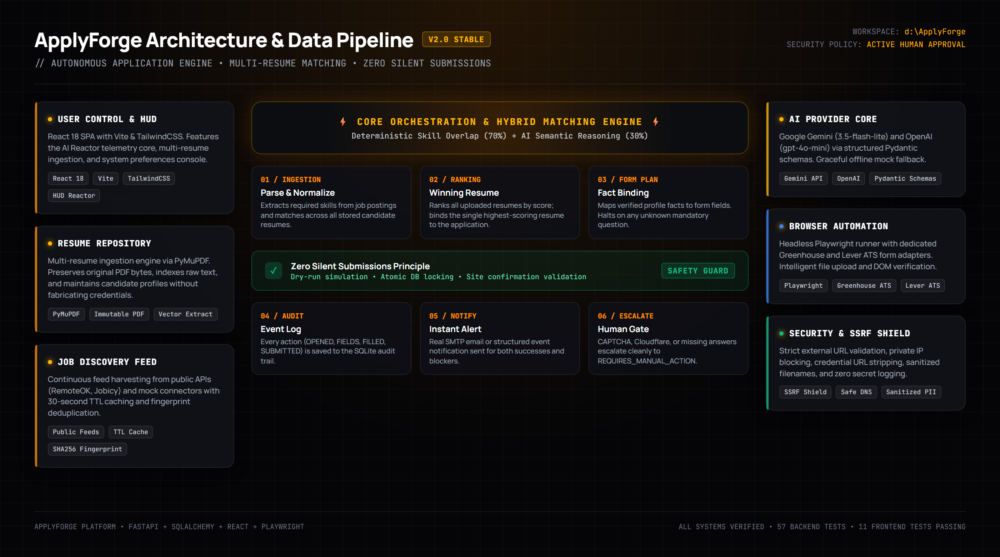
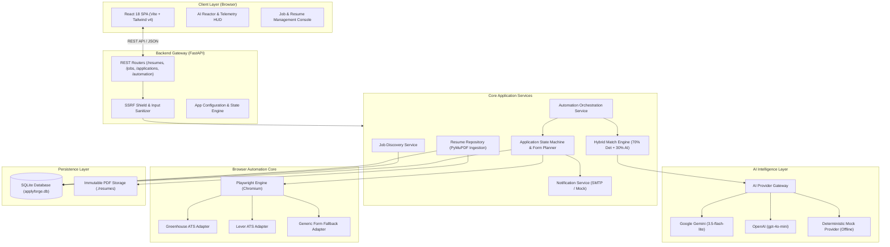
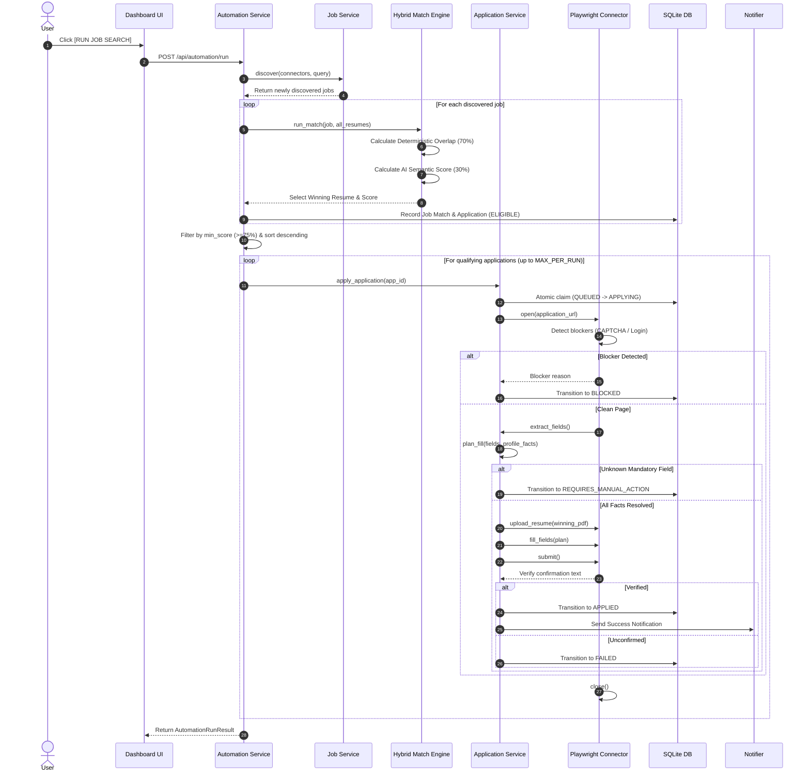
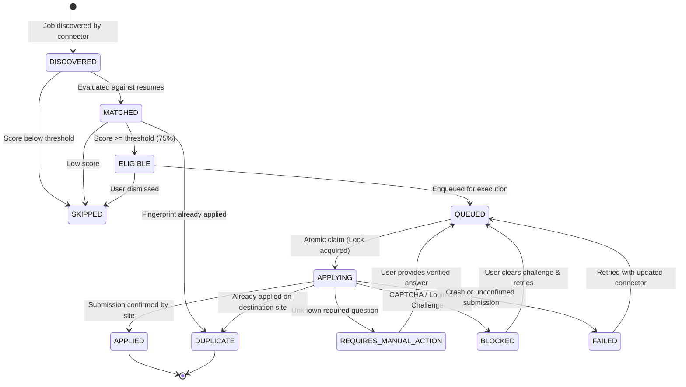
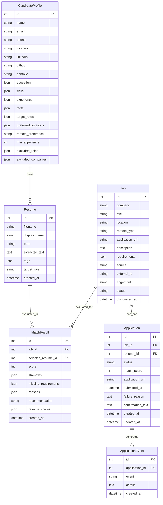
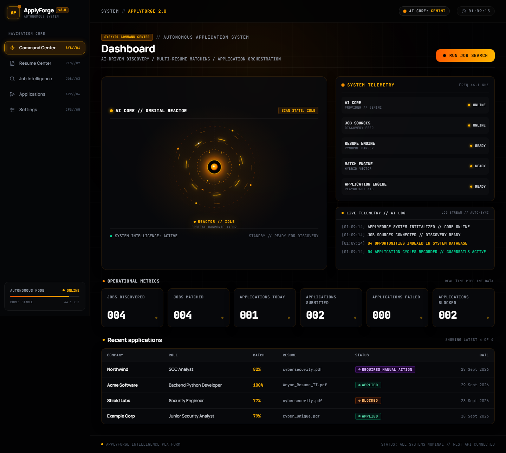
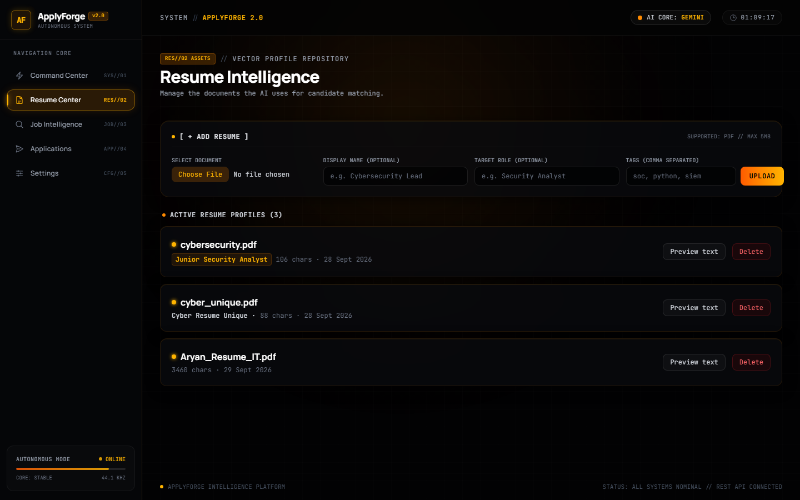
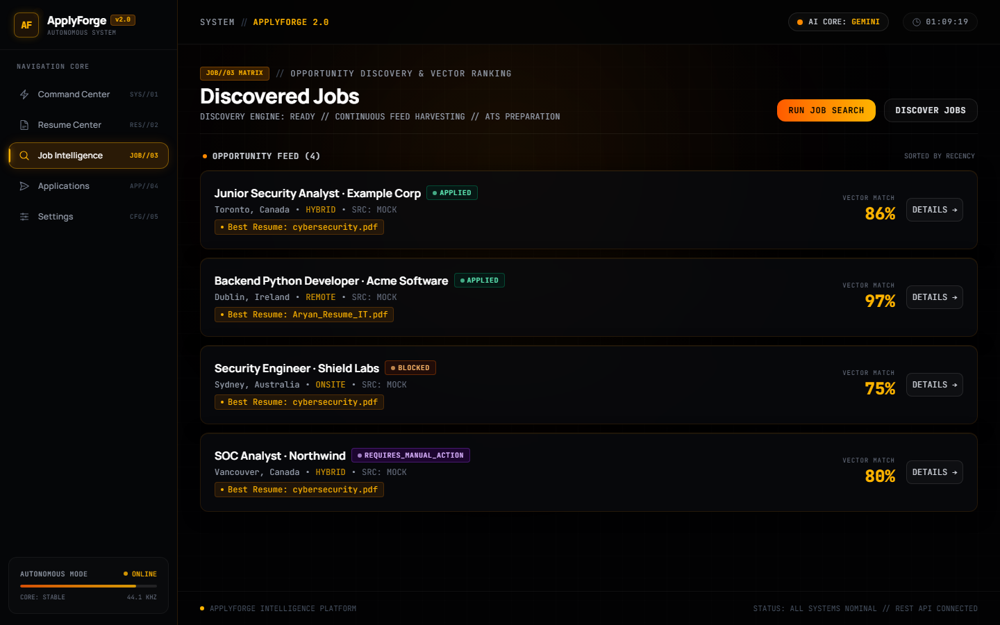
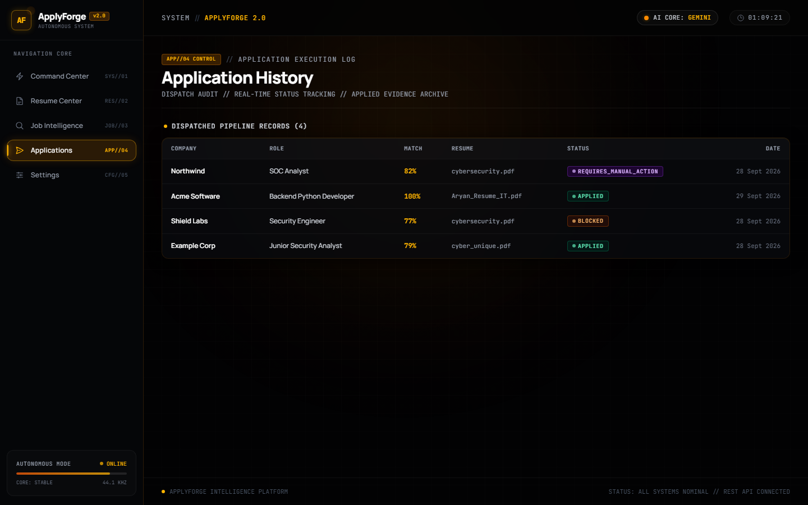
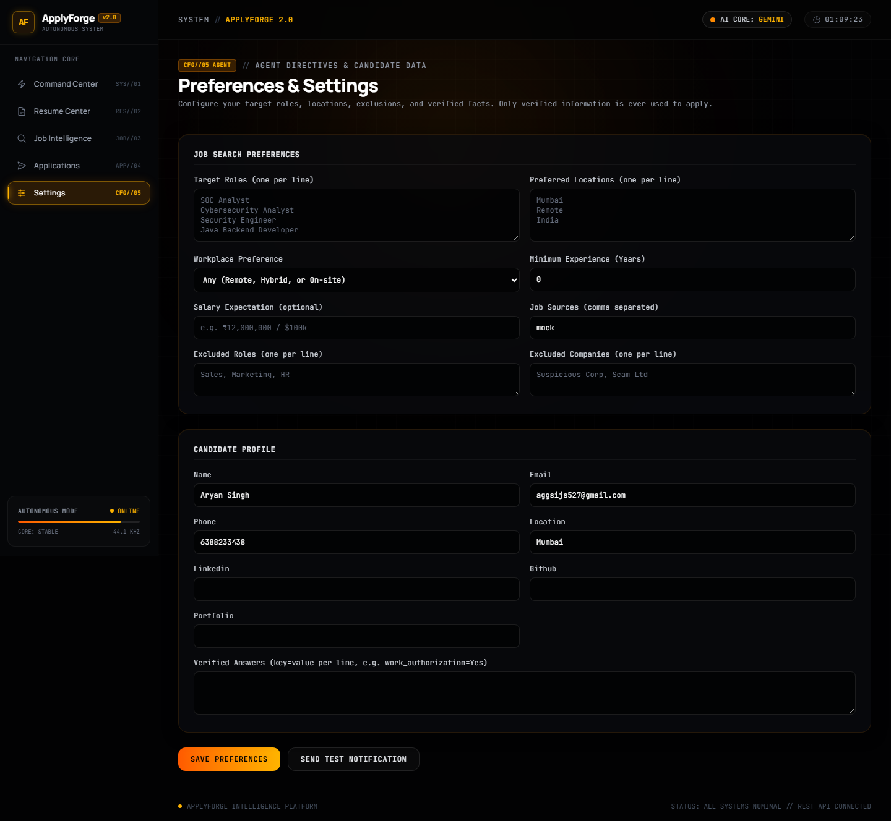

# ApplyForge ⚡

> **Autonomous Job Discovery, Multi-Resume Intelligence, and Application Automation Engine**  
> Built with strict **Zero Silent Submissions** safety guardrails, deterministic multi-resume vector matching, and headless browser automation for real-world ATS platforms.

[](https://fastapi.tiangolo.com)
[](https://react.dev)
[](https://www.typescriptlang.org)
[](https://playwright.dev)
[](https://tailwindcss.com)
[](https://python.org)
[](https://pytest.org)
[](https://vitest.dev)
[](LICENSE)

---

<p align="center">
  
</p>

---

## 📑 Table of Contents

- [Overview & Problem Solved](#-overview--problem-solved)
- [The Core Safety Principle: Zero Silent Submissions](#-the-core-safety-principle-zero-silent-submissions)
- [System Architecture](#-system-architecture)
- [End-to-End Execution Flow](#-end-to-end-execution-flow)
- [Application State Machine & Guardrails](#-application-state-machine--guardrails)
- [AI Pipeline & Hybrid Matching Engine](#-ai-pipeline--hybrid-matching-engine)
- [Job Discovery & ATS Connectors](#-job-discovery--ats-connectors)
- [Data Architecture & Entity Schema](#-data-architecture--entity-schema)
- [Security & SSRF Mitigation](#-security--ssrf-mitigation)
- [User Interface Showcase](#-user-interface-showcase)
- [Repository Structure](#-repository-structure)
- [Technology Stack](#-technology-stack)
- [Getting Started](#-getting-started)
- [Configuration Reference](#-configuration-reference)
- [Testing Suite](#-testing-suite)
- [API Surface](#-api-surface)
- [Architecture Decisions (ADRs)](#-architecture-decisions-adrs)
- [Current Limitations & Roadmap](#-current-limitations--roadmap)
- [License](#-license)

---

## 💡 Overview & Problem Solved

### The Problem
Job hunting in today's software engineering market is broken:
1. **Repetitive Form Friction**: Applying to 50+ companies means filling out the exact same candidate profile, personal facts, and work authorization questions hundreds of times.
2. **One-Size-Fits-All Failure**: Candidates have diverse expertise (e.g., Cybersecurity vs. Python Backend vs. Cloud Infrastructure), but standard job tools blindly submit a single generic resume, hurting interview callbacks.
3. **Reckless AI Wrappers ("Spray and Pray")**: Modern AI application bots hallucinate credentials, fabricate degrees or dates, bypass terms of service, and silently submit applications without human visibility.

### The Solution: ApplyForge
ApplyForge is a **personal, developer-grade job automation platform** that runs locally on your machine. It operates like an intelligent command center:
- **Multi-Resume Management**: Upload authentic PDF resumes representing distinct specializations. ApplyForge indexes raw text while preserving original PDF bytes immutably.
- **Deterministic Multi-Resume Matching**: For every discovered job, ApplyForge evaluates *every* uploaded resume, calculates transparent skill overlaps, and automatically selects the highest-scoring candidate PDF.
- **Real Browser Automation**: Employs headless Playwright with custom ATS adapters (**Greenhouse**, **Lever**, and generic forms) to open the real application URL, fill matching fields, attach the winning PDF, and verify submission.
- **Strict Human Safety**: Designed from the ground up around **Zero Silent Submissions**.

---

## 🛡️ The Core Safety Principle: Zero Silent Submissions

ApplyForge rejects unchecked, hallucination-prone AI automation. Every automation step enforces explicit guardrails:

```
[Candidate Verified Profile]
            │
            ▼
┌─────────────────────────┐     Unknown Mandatory Question
│ Field Extraction & Plan ├────────────────────────────────► [REQUIRES_MANUAL_ACTION]
└───────────┬─────────────┘                                     (Halt & request answer)
            │ All Mandatory Known
            ▼
┌─────────────────────────┐     Bot Challenge Detected
│ Pre-Submission Checks   ├────────────────────────────────► [BLOCKED]
└───────────┬─────────────┘     (CAPTCHA / Cloudflare / Auth)   (Never guess or bypass)
            │ Clean Page
            ▼
┌─────────────────────────┐     No Official Receipt
│   Playwright Submit     ├────────────────────────────────► [FAILED]
└───────────┬─────────────┘                                     (Never assume applied)
            │ Official Site Receipt Verified
            ▼
┌─────────────────────────┐
│     Status: APPLIED     │───► [Instant Email / Event Notification]
└─────────────────────────┘
```

### Safety Guarantees
1. **No Hallucinated Credentials**: Facts are sourced strictly from your stored profile. If an application asks a mandatory question not present in your profile, confidence drops to 0 and the application immediately halts in `REQUIRES_MANUAL_ACTION`.
2. **Dry-Run Capability (`dry_run=True`)**: Simulate form filling without submitting. Playwright navigates the page, extracts fields, binds facts, and logs the planned actions while leaving the application in `ELIGIBLE`.
3. **No Unchecked Submissions**: Applications are marked `APPLIED` *only* when the site returns an explicit confirmation banner or receipt text. If a site fails or does not confirm, the application is marked `FAILED`.
4. **Zero Bypass on Bot Protections**: If a portal presents a CAPTCHA, Cloudflare challenge, or mandatory account login, ApplyForge cleanly flags `BLOCKED` instead of breaking terms of service.
5. **Atomic Database Locking**: Concurrent executions run `UPDATE applications SET status='APPLYING' WHERE status='QUEUED'`, guaranteeing that two processes can never submit to the same job twice.
6. **PII Sanitization**: Application event logs store field names and metadata only—never raw personal identifiers or secret answers.

---

## 🏗️ System Architecture



---

## 🔄 End-to-End Execution Flow

When you execute **"Run Job Search"** from the Dashboard or trigger automation via API:



### Stage-by-Stage Breakdown

| Stage | Input | Processing | Output |
|---|---|---|---|
| **1. Ingestion** | Uploaded PDF resumes | Extracted via PyMuPDF. Sanitizes filenames, indexes raw character text, stores immutable binary in `./resumes/`. | `Resume` entity with parsed text & metadata. |
| **2. Discovery** | Preferences & Connectors | Queries public feeds (Jobicy/RemoteOK) or mock sources. Applies SHA256 fingerprint deduplication on `(company, title, location)`. | New `Job` records in `DISCOVERED` status. |
| **3. Matching** | Job posting + ALL resumes | Computes skill intersection and queries AI semantic evaluator. Weights 70% deterministic + 30% AI semantic. | `MatchResult` with best resume ID, match %, strengths, and missing skills. |
| **4. Planning** | Form fields + Candidate facts | Normalizes DOM inputs (inputs, textareas, selects, radios, checkboxes). Binds verified candidate answers. | `FillPlan` containing field-value pairs and missing mandatory questions. |
| **5. Guard Gate** | FillPlan & Page State | Evaluates page for Cloudflare/CAPTCHA, login requirements, and unresolved mandatory questions. | Approval to proceed or transition to `BLOCKED` / `REQUIRES_MANUAL_ACTION`. |
| **6. Automation** | Form plan + Target portal | Headless Chromium navigates to ATS, uploads selected PDF bytes, fills inputs, and clicks submit. | HTTP DOM post-submission state. |
| **7. Receipt Audit** | Submitted page DOM | Inspects DOM for explicit confirmation banners ("Application submitted", "Thank you"). | Status `APPLIED` with confirmation text, or `FAILED`. |
| **8. Notification** | Application outcome | Dispatches SMTP email or structured event with company name, job role, and resume utilized. | Delivered user notification. |

---

## 🚦 Application State Machine & Guardrails

The lifecycle of an application follows an immutable state machine enforced in [`backend/app/services/application_service.py`](backend/app/services/application_service.py):



### State Transition Matrix

| Current State | Permitted Transitions | Trigger / Condition |
|---|---|---|
| `DISCOVERED` | `MATCHED`, `SKIPPED` | Job is evaluated across stored resumes. |
| `MATCHED` | `ELIGIBLE`, `SKIPPED`, `DUPLICATE` | Outcome depends on score threshold (default: 75%) and duplicate fingerprint detection. |
| `ELIGIBLE` | `QUEUED`, `SKIPPED`, `DUPLICATE`, `MATCHED` | Scheduled for execution or re-matched after resume updates. |
| `QUEUED` | `APPLYING`, `SKIPPED` | Atomic database claim transitions job into active browser session. |
| `APPLYING` | `APPLIED`, `FAILED`, `BLOCKED`, `REQUIRES_MANUAL_ACTION`, `DUPLICATE` | Terminal outcome of browser run. |
| `REQUIRES_MANUAL_ACTION` | `QUEUED`, `DUPLICATE` | User answers the missing fact in Settings and re-queues. |
| `BLOCKED` | `QUEUED`, `DUPLICATE` | User manually clears CAPTCHA or updates URL and retries. |
| `FAILED` | `QUEUED`, `DUPLICATE` | Retried after fixing connection/DOM errors. |
| `APPLIED` | *(Terminal)* | Immutable record. Cannot be applied to again. |
| `DUPLICATE` | *(Terminal)* | Prevented from re-application. |

---

## 🧠 AI Pipeline & Hybrid Matching Engine

ApplyForge avoids the pitfalls of purely LLM-based decision systems by using a **Hybrid Scoring Model**:

$$\text{Final Score} = \text{round}(0.70 \times \text{Deterministic Score} + 0.30 \times \text{Semantic Score})$$

```
Job Description + Requirements
      │
      ├───────────────────────────────┐
      ▼ (70% Weight)                  ▼ (30% Weight)
Deterministic Engine            AI Semantic Evaluator
- Regex & token skill parser    - Structured Output (Pydantic)
- Literal keyword overlap       - Gemini 3.5 / OpenAI gpt-4o-mini
- Mandatory cert matching       - Synthesizes experience depth
- Target role alignment         - Offline Mock fallback
      │                               │
      └───────────────┬───────────────┘
                      ▼
             Final Weighted Score (0 - 100)
```

### Deterministic Engine (70% Weight)
- Scans job requirements and description for known technical competencies across security, cloud, backend, database, and devops stacks.
- Computes mathematical set intersection: $\text{Overlap} = \frac{|\text{Required} \cap \text{Resume}|}{|\text{Required}|} \times 100$.
- Checks explicit industry certifications (`Security+`, `CEH`, `CISSP`, `OSCP`, `AWS Certified`, `CompTIA`).
- Validates role alignment between candidate target role and posting title.

### AI Semantic Evaluator (30% Weight)
- Uses **Pydantic Structured Outputs** via Google Gemini (`gemini-3.5-flash-lite`) or OpenAI (`gpt-4o-mini`).
- Schema guarantees type-safe responses:
  ```python
  class SemanticMatch(BaseModel):
      score: int = Field(ge=0, le=100)
      reasons: list[str]
  ```
- **Resilience**: If the AI API experiences rate limits (HTTP 429) or connection loss, ApplyForge automatically falls back to 100% deterministic scoring without halting the application pipeline.

### Fact-Answering Prompt Guard
Application questions are processed with strict anti-hallucination prompts:
```text
Answer the application question using ONLY the provided facts. If the facts do not clearly contain
the answer, return answer=null and confidence=0. Never guess or invent employers, degrees,
certifications, dates, job titles, skills or achievements.
```
Answers with confidence below `0.7` are rejected, halting the form in `REQUIRES_MANUAL_ACTION`.

---

## 🌐 Job Discovery & ATS Connectors

### Job Discovery Connectors
1. **Public Tech Feeds (`public_feed`)**:
   - Ingests verified postings from public developer job feeds (RemoteOK, Jobicy, Arbeitnow).
   - Features a **30-second TTL in-memory cache** to prevent API spamming.
   - Built-in offline fallback snapshots ensure development continues even when offline.
2. **Mock Connector (`mock`)**:
   - Provides deterministic job postings across Cybersecurity Analyst, Python Developer, Java Engineer, and SOC Analyst roles for unit/integration testing.

### Browser Automation ATS Adapters
The Playwright connector inspects destination pages and delegates to specialized adapters:

```
                  Playwright Application Connector
                                 │
                   Check URL & DOM Fingerprint
                                 │
         ┌───────────────────────┼───────────────────────┐
         ▼                       ▼                       ▼
Greenhouse Adapter         Lever Adapter          Generic Adapter
(boards.greenhouse.io)     (jobs.lever.co)        (Fallback DOM)
- Native file upload       - Smart file input     - Heuristic inputs
- Custom question lookup   - Multi-page wizard    - Candidate fields
- Checkbox consent         - Direct submit        - Sanity check guard
```

- **Application URL Sanity Checking**: Automatically verifies that destination URLs represent interactive application forms. Generic job listings or dead links fail fast as `BLOCKED` rather than submitting unpredictably.
- **File Upload Handler**: Attaches candidate PDF bytes directly into DOM file inputs without modifying the file.

---

## 💾 Data Architecture & Entity Schema

ApplyForge uses SQLite with SQLAlchemy ORM. All timestamps are naive UTC.



---

## 🔒 Security & SSRF Mitigation

Because ApplyForge executes browser automation against arbitrary job URLs, robust security protections are built into [`backend/app/security.py`](backend/app/security.py):

### 1. SSRF Shield (`validate_external_url`)
- **Protocol Enforcement**: Only `http://` and `https://` schemes are permitted.
- **Credential Stripping**: Reject URLs with embedded credentials (`user:pass@host`).
- **Private IP Rejection**: Resolves the hostname via `socket.getaddrinfo` and verifies via `ipaddress.ip_address(...).is_global` that the target does NOT resolve to private, loopback, or reserved IP ranges (e.g. `127.0.0.1`, `10.0.0.0/8`, `192.168.0.0/16`, `169.254.0.0/16`).
- **Localhost Guard**: Disallows `localhost` unless `ALLOW_LOCAL_URLS=true` is explicitly configured for testing.

### 2. Path Traversal & File Sanitization
- `sanitize_filename`: Strips directory separators (`/`, `\`) and non-alphanumeric characters, enforcing safe filenames within `./resumes/`.

### 3. PII & Secret Isolation
- Sensitive candidate profile facts and authorization tokens are strictly isolated from client error traces and event log summaries.
- `.env` files are strictly excluded via `.gitignore` with dedicated `.env.example` templates.

---

## 🖥️ User Interface Showcase

ApplyForge 2.0 features a dark, cinematic AI Command Center interface designed with **Manrope** typography, **JetBrains Mono** telemetry, and amber/orange reactor glow accents.

### 1. Central AI Command Center (`/`)
The operational core featuring the live **AI Orbital Reactor**, real-time subsystem telemetry, live telemetry event stream, 3-digit monospace operational metrics, and the recent applications console.

<p align="center">
  
</p>

---

### 2. Resume Intelligence Center (`/resumes`)
Multi-resume ingestion engine. Upload PDF vectors, view extracted characters, manage target roles and tags, and inspect extracted resume text in an interactive terminal.

<p align="center">
  
</p>

---

### 3. Discovered Opportunity Matrix (`/jobs`)
Full-width opportunity discovery feed. Displays vector match percentages, best resume indicators, company metadata, and one-click triggers for **Run Job Search** and **Discover Jobs**.

<p align="center">
  
</p>

---

### 4. Application Execution & Dispatch History (`/applications`)
Live audit log tracking application outcomes, verified match scores, winning resume artifacts, and status badges (`APPLIED`, `BLOCKED`, `REQUIRES_MANUAL_ACTION`, `FAILED`).

<p align="center">
  
</p>

---

### 5. Candidate Preferences & Verified Facts (`/settings`)
Configure target roles, preferred locations, company/role exclusions, and verified candidate facts (`work_authorization=Yes`, `sponsorship=No`) that the AI binds to mandatory form questions.

<p align="center">
  
</p>

---

## 📂 Repository Structure

```text
ApplyForge/
├── backend/                       # Python FastAPI Backend
│   ├── app/
│   │   ├── ai/                    # Structured outputs, Gemini/OpenAI & mock clients
│   │   │   ├── application_answers.py # Fact answering & confidence validators
│   │   │   ├── client.py          # AI Provider gateway (Gemini/OpenAI/Mock)
│   │   │   └── matching.py        # Semantic match prompts & schemas
│   │   ├── connectors/            # Job feeds and browser automation connectors
│   │   │   ├── base.py            # Connector interfaces & FormField definitions
│   │   │   ├── greenhouse.py      # Greenhouse ATS form adapter
│   │   │   ├── lever.py           # Lever ATS form adapter
│   │   │   ├── mock.py            # Deterministic mock application connector
│   │   │   ├── playwright_connector.py # Playwright browser runner
│   │   │   └── public_feed.py     # Public tech job feeds (RemoteOK/Jobicy)
│   │   ├── models/                # SQLAlchemy database models & enum definitions
│   │   │   ├── entities.py        # CandidateProfile, Resume, Job, Application, Events
│   │   │   └── enums.py           # ApplicationStatus state definitions
│   │   ├── routers/               # FastAPI endpoint routers
│   │   │   ├── applications.py    # /api/applications routes
│   │   │   ├── automation.py      # /api/automation orchestration routes
│   │   │   ├── health.py          # /api/health endpoint
│   │   │   ├── jobs.py            # /api/jobs routes & matching triggers
│   │   │   ├── profile.py         # /api/profile routes
│   │   │   ├── resumes.py         # /api/resumes upload & preview routes
│   │   │   └── settings.py        # /api/settings configuration routes
│   │   ├── schemas/               # Pydantic request/response schemas
│   │   ├── services/              # Core business services
│   │   │   ├── application_service.py # Application state machine & form planner
│   │   │   ├── automation_service.py  # End-to-end pipeline coordinator
│   │   │   ├── browser_service.py     # Playwright automation engine
│   │   │   ├── job_service.py         # Job discovery & deduplication
│   │   │   ├── matching_service.py    # Hybrid 70/30 match engine
│   │   │   ├── notification_service.py# SMTP & mock alert dispatch
│   │   │   └── resume_service.py      # PyMuPDF parser & repository
│   │   ├── config.py              # Application settings via Pydantic-Settings
│   │   ├── database.py            # SQLite engine & session management
│   │   ├── errors.py              # Centralized ServiceError handlers
│   │   ├── main.py                # FastAPI app initialization & CORS setup
│   │   ├── security.py            # SSRF validation & filename sanitization
│   │   └── skills.py              # Deterministic technical skill catalog
│   ├── tests/                     # Pytest suite (57 backend tests)
│   ├── requirements.txt           # Python production dependencies
│   └── .env.example               # Backend environment variable template
├── frontend/                      # React + TypeScript Frontend (Vite)
│   ├── src/
│   │   ├── components/            # UI components
│   │   │   ├── ai/                # AIReactor, AISystemLog, AISystemStatus
│   │   │   ├── shell/             # AppShell, Sidebar, TopBar navigation
│   │   │   ├── ApplicationsTable.tsx # Dark data table for applications
│   │   │   ├── JobList.tsx        # Discovered opportunity card list
│   │   │   ├── ResumeList.tsx     # Ingested resume card list & preview
│   │   │   ├── StatCard.tsx       # 3-digit monospace metric card
│   │   │   └── StatusBadge.tsx    # Cybernetic pill status badges
│   │   ├── pages/                 # Route page views
│   │   │   ├── ApplicationDetail.tsx # Event dispatch audit view
│   │   │   ├── Applications.tsx   # Application history page
│   │   │   ├── Dashboard.tsx      # Main AI Command Center HUD
│   │   │   ├── JobDetail.tsx      # Intelligence dossier & match breakdown
│   │   │   ├── Jobs.tsx           # Discovered job matrix page
│   │   │   ├── Resumes.tsx        # Resume intelligence upload center
│   │   │   └── Settings.tsx       # System preferences & verified facts
│   │   ├── services/              # API communication layer (Axios / Fetch)
│   │   ├── test/                  # Vitest suite (11 frontend tests)
│   │   ├── types/                 # Shared TypeScript interfaces
│   │   ├── App.tsx                # Client router configuration
│   │   ├── index.css              # TailwindCSS v4 design tokens & keyframes
│   │   └── main.tsx               # DOM entry point
│   ├── package.json               # Node.js dependencies & scripts
│   └── vite.config.ts             # Vite configuration & proxy settings
├── data/                          # SQLite database & local storage directory
├── docs/                          # Architecture documentation & visual assets
│   └── assets/                    # High-resolution screenshots & diagrams
├── resumes/                       # Local directory for uploaded candidate PDFs
├── scripts/                       # Developer utility scripts
│   └── make_sample_resumes.py     # Generates 5 sample PDF resumes
└── README.md                      # Comprehensive project documentation
```

---

## 🛠️ Technology Stack

| Layer | Technology | Primary Role |
|---|---|---|
| **Frontend Framework** | **React 18** | High-performance component-based client UI. |
| **Build & Tooling** | **Vite 6** | Ultra-fast HMR and optimized production bundling. |
| **Language (Web)** | **TypeScript 5.6** | Static type safety across client interfaces and API payloads. |
| **Styling & HUD** | **TailwindCSS v4** | Dark design tokens, amber glow effects, and responsive layout. |
| **Backend Framework** | **FastAPI 0.115+** | Asynchronous, OpenAPI-compliant high-performance REST API. |
| **Language (API)** | **Python 3.10+** | Expressive language powering backend logic and data pipelines. |
| **Database & ORM** | **SQLite + SQLAlchemy** | Reliable relational storage with atomic update transactions. |
| **Browser Automation**| **Playwright** | Headless Chromium automation for real-world ATS form submission. |
| **Document Processing**| **PyMuPDF (fitz)** | Rapid, lossless PDF text extraction and binary validation. |
| **AI Provider** | **Gemini & OpenAI** | Structured evaluation via `gemini-3.5-flash-lite` or `gpt-4o-mini`. |
| **Validation** | **Pydantic v2** | Strict data validation for configuration, requests, and AI responses. |
| **Testing** | **Pytest & Vitest** | 57 backend tests and 11 frontend tests verifying full pipeline integrity. |

---

## 🚀 Getting Started

### Prerequisites
- **Python 3.10+**
- **Node.js 18+** & **npm**
- **Chromium browser for Playwright**

---

### Step 1: Clone the Repository
```bash
git clone git@github.com:tigpy/ApplyForge.git
cd ApplyForge
```

---

### Step 2: Backend Setup
```bash
cd backend

# Create and activate Python virtual environment
python -m venv .venv
.venv\Scripts\activate       # On Linux/macOS: source .venv/bin/activate

# Install dependencies
pip install -r requirements.txt

# Install Playwright browser binary
python -m playwright install chromium

# Copy environment configuration
cp .env.example .env

# Run FastAPI backend server
uvicorn app.main:app --reload --port 8000
```
- **API Server live**: `http://127.0.0.1:8000`
- **Interactive OpenAPI Documentation**: `http://127.0.0.1:8000/docs`

---

### Step 3: Frontend Setup
In a second terminal:
```bash
cd frontend

# Install Node modules
npm install

# Start Vite development server
npm run dev
```
- **Web UI live**: `http://localhost:5173`

---

### Step 4: Generate Sample Resumes (Optional)
To instantly populate your local instance with sample resumes across multiple engineering domains:
```bash
# From project root
python scripts/make_sample_resumes.py
```
This generates 5 distinct resumes in `./resumes/`:
1. `cybersecurity.pdf` (Cybersecurity Analyst)
2. `soc-analyst.pdf` (SOC Analyst)
3. `backend-developer.pdf` (Backend Python Developer)
4. `java-developer.pdf` (Java Backend Developer)
5. `fresher-general.pdf` (Junior Software Developer)

---

## ⚙️ Configuration Reference

Copy `backend/.env.example` to `backend/.env`. All values are optional for local offline development (runs in mock mode by default).

| Variable | Description | Default | Allowed Values |
|---|---|---|---|
| `GEMINI_API_KEY` | Google AI Studio Gemini API Key | `""` | Valid Gemini API Key |
| `GEMINI_MODEL` | Gemini Model Identifier | `gemini-3.5-flash-lite` | Supported Gemini models |
| `OPENAI_API_KEY` | OpenAI API Key | `""` | Valid OpenAI API Key |
| `OPENAI_MODEL` | OpenAI Model Identifier | `gpt-4o-mini` | `gpt-4o-mini`, `gpt-4o` |
| `AI_PROVIDER` | Active AI provider mode | `auto` | `auto`, `gemini`, `openai`, `mock` |
| `DATABASE_URL` | SQLite database connection string | `sqlite:///./data/applyforge.db` | Valid SQLAlchemy DB URL |
| `RESUME_DIR` | Directory for uploaded resume PDFs | `./resumes` | Directory path |
| `APPLICATION_CONNECTOR` | Active application execution connector | `mock` | `mock`, `playwright` |
| `BROWSER_HEADLESS` | Run Playwright browser in headless mode | `true` | `true`, `false` |
| `MATCH_THRESHOLD` | Minimum score percentage to mark application ELIGIBLE | `75` | `0` - `100` |
| `MAX_APPLICATIONS_PER_RUN`| Max applications submitted per automated batch | `10` | Positive integer |
| `ALLOW_LOCAL_URLS` | Allow local URLs (for test automation servers) | `false` | `true`, `false` |
| `CORS_ORIGINS` | Permitted frontend origins | `http://localhost:5173` | Comma-separated URLs |
| `SMTP_HOST` | SMTP server host for email notifications | `""` | Hostname |
| `SMTP_PORT` | SMTP server port | `587` | Port number |
| `SMTP_USERNAME` | SMTP account username | `""` | Username |
| `SMTP_PASSWORD` | SMTP account password | `""` | Password |
| `NOTIFICATION_EMAIL` | Destination email address for notifications | `""` | Email address |
| `NOTIFICATION_MODE` | Notification dispatch strategy | `auto` | `auto`, `email`, `mock` |

> [!CAUTION]
> Never commit `.env` or paste live API keys into public repositories. `.gitignore` is configured to prevent accidental leakage.

---

## 🧪 Testing Suite

ApplyForge enforces comprehensive automated testing covering unit, integration, state machine, and browser automation levels.

```bash
# 1. Run all Backend Pytest Suites (57 tests passing)
cd backend
.venv\Scripts\pytest -v

# 2. Run Frontend Vitest Component Suites (11 tests passing)
cd frontend
npm test -- --run

# 3. Verify Frontend Production Typecheck & Build
cd frontend
npm run build
```

### Test Coverage Highlights
- **State Machine Transitions**: Verifies all allowed and rejected state transitions (`DISCOVERED` $\rightarrow$ `MATCHED` $\rightarrow$ `ELIGIBLE` $\rightarrow$ `QUEUED` $\rightarrow$ `APPLYING` $\rightarrow$ `APPLIED`).
- **ATS Adapter Verification**: Unit tests with live DOM mock servers validating Greenhouse and Lever field extraction, checkbox handling, file upload, and receipt verification.
- **SSRF Shield Tests**: Tests blocking private IP ranges (`10.0.0.1`, `192.168.1.1`), loopback interfaces, credentials in URLs, and non-HTTP protocols.
- **Atomic Locking Tests**: Simulates concurrent application claims, ensuring zero double-submissions.
- **AI Fallback Tests**: Validates that AI rate limits (HTTP 429) or offline states fall back seamlessly to deterministic skill scoring.

---

## 🔌 API Surface

ApplyForge exposes a clean, self-documenting REST API. Interactive Swagger documentation is available at `http://localhost:8000/docs`.

### Core Endpoint Groups

| Group | Method | Path | Description |
|---|---|---|---|
| **Resumes** | `GET` | `/api/resumes` | List all ingested candidate resume profiles. |
| | `POST` | `/api/resumes` | Upload a new PDF resume with optional target role and tags. |
| | `GET` | `/api/resumes/{id}` | Retrieve resume metadata and extracted text. |
| | `DELETE` | `/api/resumes/{id}` | Delete a resume profile. |
| **Jobs** | `GET` | `/api/jobs` | List discovered jobs with vector match scores and status. |
| | `POST` | `/api/jobs/discover` | Trigger discovery from public feeds or mock connectors. |
| | `GET` | `/api/jobs/{id}` | Retrieve job intelligence dossier, match report, and requirements. |
| | `POST` | `/api/jobs/{id}/match` | Force recalculation of multi-resume match scores for a job. |
| | `POST` | `/api/jobs/{id}/apply` | Execute application flow for a specific job (supports dry run). |
| **Applications**| `GET` | `/api/applications` | List all tracked applications with status and timestamps. |
| | `GET` | `/api/applications/{id}`| Retrieve application audit log and step-by-step event timeline. |
| **Automation** | `POST` | `/api/automation/run` | Execute full autonomous discovery, matching, and application batch. |
| **Profile** | `GET` | `/api/profile` | Retrieve verified candidate facts, preferences, and exclusions. |
| | `PUT` | `/api/profile` | Update candidate facts and job search preferences. |
| **Health** | `GET` | `/api/health` | Subsystem telemetry and AI provider status check. |

---

## 📐 Architecture Decisions (ADRs)

### 1. Why Hybrid Matching instead of Pure LLM Matching?
LLMs are prone to hallucinations, non-deterministic scoring, and rate limits. A candidate with "Python, Docker, AWS" could be scored differently across runs. By weighting **70% deterministic skill overlap** and **30% semantic evaluation**, ApplyForge guarantees consistent, explainable results with resilient offline fallback.

### 2. Why Playwright over Selenium or Puppeteer?
Playwright provides superior async/await execution, built-in network idle waiting, reliable file upload primitives (`set_input_files`), and headful debugging. It easily handles modern single-page ATS applications like Greenhouse and Lever.

### 3. Why Zero Silent Submissions?
Unattended bots applying to hundreds of jobs burn bridges with recruiters, trigger anti-bot bans, and submit inaccurate answers. Enforcing **explicit human verification of unknown facts** and **unmistakable confirmation receipts** ensures high application quality and candidate reputation safety.

### 4. Why SQLite instead of PostgreSQL for the Core?
ApplyForge is built as a **personal developer tool**, not a multi-tenant SaaS. SQLite requires zero configuration, stores data in a single local file (`./data/applyforge.db`), supports atomic transactions, and eliminates unnecessary Docker/infrastructure overhead.

---

## 🚧 Current Limitations & Roadmap

### Current Limitations
- **Multi-Step Account Portals**: Full automation is optimized for single-page and two-step ATS platforms (Greenhouse, Lever). Portals requiring multi-step account creation (e.g. Workday, Taleo) flag `BLOCKED` to allow manual user sign-in.
- **CAPTCHA Bypass**: ApplyForge deliberately does not integrate CAPTCHA-solving farms to preserve ethical compliance and prevent anti-bot retaliation.
- **PDF Generation**: Resumes are ingested and preserved byte-for-byte; automatic PDF synthesis/editing is not supported to ensure candidate authenticity.

### Future Roadmap
- [ ] **Workday & iCIMS ATS Adapters**: Semi-automated companion mode for complex enterprise portals.
- [ ] **Interactive Form Review Modal**: Live modal allowing instant approval of `REQUIRES_MANUAL_ACTION` fields directly from the Dashboard.
- [ ] **Job Search Query Customization**: UI controls for dynamic search keywords and remote region filters.
- [ ] **Weekly Application Performance Digest**: Visual reporting on interview conversion rates and ATS pass-through.

---

## 📄 License

ApplyForge is licensed under the [MIT License](LICENSE). Built for ethical, personal job search automation.
